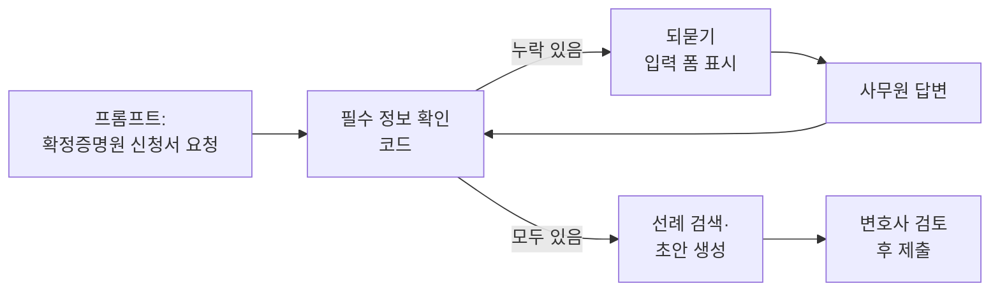
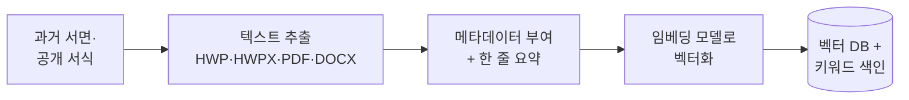
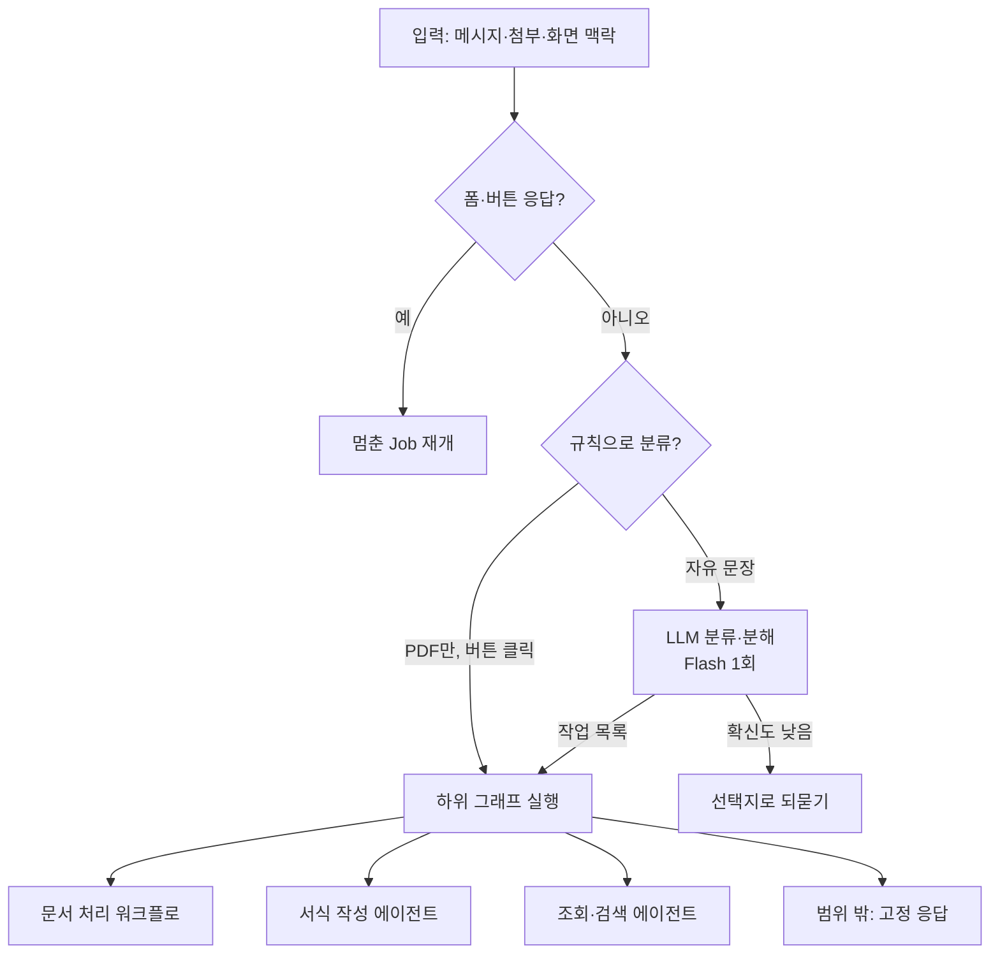
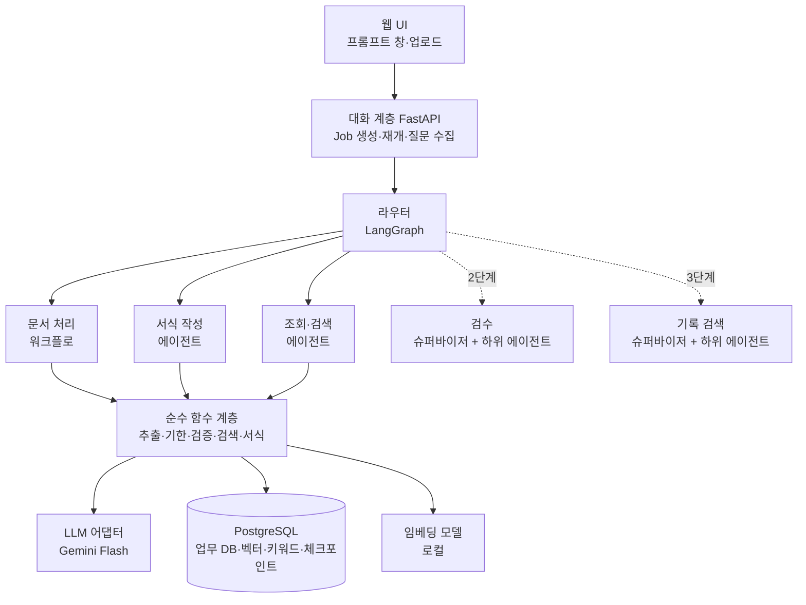

# lawca 기획서 — 법무법인 사무원용 송무 AI 에이전트

2026-09-21 작성 · 2026-09-26 갱신

## 1. 개요

lawca는 법무법인 사무원이 법원 문서 PDF를 올리거나 프롬프트 창에 작업을 요청하면, 할 일과 기한을 뽑고 유사한 과거 서면을 찾아 대응 서류 초안까지 만들어 주는 송무 에이전트다. 정보가 빠져 있으면 되묻고, 답을 받으면 멈춘 곳에서 이어간다.

**검증 상태**: 현직 사무원과 소통하지 않고 진행한다(2026-09-26 결정). 업무 규칙은 법령 원문과 공개 자료로 확인하고, 추출 정확도는 공개 판결문과 합성 문서로 잰다. 실제 사용자 검증이 없다는 점은 10번 리스크로 관리한다.

**풀려는 문제**

- 사무원은 보정명령, 결정문, 판결문을 매일 받고, 문서마다 무엇을 언제까지 해야 하는지 직접 읽어 판단한다.
- 불변기간(항소 2주, 즉시항고 1주 등)을 하루만 넘겨도 되돌릴 수 없는 사고가 된다.
- 보정서, 증명원 신청서 같은 반복 서식을 사건마다 손으로 다시 채운다. 참고할 과거 서면은 파일 서버를 뒤져 찾는다.

**목표**

- 문서 1건을 올린 뒤 할 일, 기한, 초안이 나오기까지 1분 이내(송달일 확인 같은 사용자 응답 대기 시간은 제외).
- 핵심 필드(사건번호, 당사자, 문서 종류, 발령일) 추출 정확도 95% 이상. 공개 판결문과 합성 문서로 만든 평가 세트로 측정하고, 수치에는 평가 기준을 함께 적는다.
- 기한 계산 오류 0건. LLM이 아닌 코드로 계산하고 테스트로 증명한다.

**비목표**

- 법률 자문이나 승소 가능성 판단은 하지 않는다.
- 전자소송 제출을 자동화하지 않는다. 제출 직전 파일까지만 만든다.
- 기존 사건관리 프로그램을 대체하지 않는다. 옆에 두고 쓰는 보조 도구로 시작한다.
- 기한 관리 시스템을 대체하지 않는다. 법인이 이미 쓰는 사건관리 프로그램과 겹치지 않도록, 계산한 기한은 캘린더(ICS)·엑셀로 내보내 연동한다. lawca의 차별점은 법원 문서 해석에서 할 일, 대응 서식 초안으로 이어지는 흐름이다.

## 2. 타깃 사용자와 핵심 시나리오

1차 사용자는 법무법인 송무팀 사무원이고, 2차 사용자는 초안을 검토·승인하는 담당 변호사다.

| 사용자 | 하는 일 | lawca에서 얻는 것 |
| --- | --- | --- |
| 사무원 | 법원 문서 수령, 기한 관리, 서식 작성, 증거 정리, 전자소송 제출 | 할 일·기한 자동 추출, 서식 초안, 제출 전 검수 |
| 담당 변호사 | 서면 작성, 사무원 산출물 확인 | 원문 근거가 붙은 추출 결과와 초안을 빠르게 승인 |

**대표 시나리오: 주소보정명령 대응**

사무원은 추출값이 원문과 맞는지 확인하고, 초안을 내려받아 전자소송에 직접 제출한다. 제출은 항상 사람이 한다.

**대표 시나리오 2: 받은 문서 없이 서식 요청**

증명원 신청, 집행문부여 신청, 사실조회신청처럼 사무원이 먼저 시작하는 업무는 프롬프트 창으로 들어온다. 사건번호만 받으면 법원·당사자·담당자는 DB에서 채우고, 없는 정보만 묻는다.

## 3. 기능 범위

MVP는 1\~7번을 라우터와 전문 에이전트 구조로 묶고, 나머지는 검증 뒤에 붙인다.

| 순위 | 기능 | 내용 | 단계 |
| --- | --- | --- | --- |
| 1 | 법원 문서 해석 | 보정명령·결정문·판결문 PDF에서 문서 종류, 사건번호, 당사자, 발령일, 명령 내용, 문서에 기재된 기간(예: 송달일부터 7일 이내) 추출. 송달일은 문서에 없으므로 사무원에게 확인 | MVP |
| 2 | 기일·불변기간 계산 | 송달일 기준 기한 자동 계산(초일불산입, 공휴일 처리). 법정 기간은 규칙 표로, 재판장이 정한 기간은 문서에서 추출한 값으로 계산, 할 일 체크리스트 | MVP |
| 3 | 과거 서면·서식 검색 | 수신 문서 내용으로 유사한 과거 서면·공개 서식을 자동 검색(메타데이터 필터 + 키워드 + 벡터). 결과를 출처와 함께 보여 주고 초안의 예시로 사용. MVP의 검색 대상은 공개 서식(빈 양식)이라 맞는 서식 찾기 역할을 하고, 법인 문체 반영은 법인 서면을 색인한 뒤에 나온다 | MVP |
| 4 | 송무 서식 초안 | 보정서, 주소보정서, 당사자표시정정신청, 송달·확정증명원 신청서. 템플릿이 없는 유형은 검색된 선례를 바탕으로 초안 작성 | MVP |
| 5 | 프롬프트 창(에이전트) | 라우터가 자연어 요청을 분류·분해해 전문 에이전트(서식 작성, 조회·검색)와 문서 처리 워크플로에 넘긴다. 받은 문서 없이 시작하는 서식 요청, 초안 수정 지시, 선례 검색, 기한 조회. 정보가 빠지면 되묻고 멈춘 곳에서 재개(LangGraph) | MVP |
| 6 | 기존 사건 일괄 가져오기 | 엑셀·CSV 사건 목록을 가져와 사건·당사자 DB를 채운다. 도입 첫날 DB가 비어 있으면 자동 채움이 동작하지 않는다 | MVP |
| 7 | 기한 내보내기 | 확정된 기한을 캘린더(ICS)·엑셀로 내보내 기존 사건관리 방식과 연동 | MVP |
| 8 | 증거 정리 | 호증 번호 부여, 증거목록·증거설명서 초안, PDF 병합·쪽번호 | 2단계 |
| 9 | 제출 전 검수 | 당사자 표시 일치, 금액 합계, 첨부 누락, 인지액 확인 | 2단계 |
| 10 | 추가 송무 서식 | 사실조회·문서제출명령 신청, 집행문부여, 소송비용액확정 | 2단계 |
| 11 | 보전·집행 서식 | 가압류·가처분, 채권압류·추심, 재산명시 신청 | 3단계 |
| 12 | 비용 계산기 | 소가 산정, 인지대·송달료 계산(단가는 설정값) | 3단계 |
| 13 | 의뢰인 안내문 | 진행 상황 안내, 필요서류 요청 메시지 초안 | 3단계 |
| 14 | 사건 기록 검색 | 수백 쪽 이상 사건 기록에서 관련 부분 검색. 증거 정리와 제출 전 검수를 지원 | 3단계 |

**제외**: 등기 업무(법무사 사무소 영역), 전자소송·나의 사건검색 자동 연동(공개 API 없음, 인증서·캡차 필요), 판례 리서치, 개인회생·파산 패키지(해당 팀이 있는 법인에서 수요 확인 후 재검토).

## 4. MVP 상세 흐름

PDF 1건이 6단계를 거쳐 검토 가능한 초안이 된다. LLM은 1·4·6단계에만 쓰고, 2·3단계는 코드, 5단계는 검색 엔진이다. 송달일은 문서에 적혀 있지 않으므로 2단계 뒤에 멈춰 사무원에게 묻고, 답을 받으면 3단계부터 이어간다. 이 중단과 재개가 매 문서의 기본 경로다.

| 단계 | 입력 | 처리 | 출력 | 담당 |
| --- | --- | --- | --- | --- |
| 1. 추출 | 법원 문서 PDF(스캔본 포함) | 문서 분류, 필드 추출(사건번호, 당사자, 발령일, 명령 내용, 문서에 기재된 기간), 필드별 원문 인용·쪽수 반환 | 구조화된 JSON | LLM |
| 2. 검증 | 추출 JSON | 사건번호 형식(예: 2026가단12345), 날짜 형식, 필수 필드 누락 검사 | 검증 결과, 경고 목록 | 코드 |
| 3. 기한 계산 | 문서 종류, 송달일(사무원 확인값) | 법정 기간은 규칙 표 조회, 재판장 지정 기간은 추출값 사용. 초일불산입·공휴일 처리 | 기한 목록 | 코드 |
| 4. 체크리스트 | 명령 내용, 문서 종류 | 규칙 기반 기본 항목 + LLM 보완 | 할 일·필요서류 목록 | 코드 + LLM |
| 5. 선례 검색 | 문서 종류, 명령 내용 요약 | 메타데이터 필터 → 키워드 + 벡터 유사도 검색 | 유사 서면·서식 상위 3\~5건(출처 포함) | 검색 엔진 |
| 6. 초안 | 사건 정보, 서식 템플릿, 검색된 선례 | 템플릿이 있으면 필드 채우기, 없으면 선례를 예시로 LLM이 작성 | DOCX 파일, 참고한 선례 목록 | 코드 + LLM |

**사전 작업: 색인**

검색 대상 문서는 미리 색인해 둔다. LLM은 검색에 관여하지 않고, 검색된 몇 건만 받아 초안에 쓴다.

- 보정서·신청서는 1\~3쪽이라 문서 단위로 벡터화한다. 긴 준비서면만 쪼갠다.
- 원문에는 당사자명·주소 같은 잡음이 많아, 색인할 때 만든 한 줄 요약을 벡터화한다.
- 초기 검색 대상은 공개 서식(대법원 전자소송 양식, 대한법률구조공단 법률서식)이다. 법인의 과거 서면은 같은 파이프라인으로 일괄 들여온다. 공개 서식은 대부분 HWP 파일이므로 HWP 텍스트 추출을 0단계에서 먼저 확인한다.

**프롬프트 창: 에이전트 흐름**

모든 요청은 라우터를 거친다. 라우터는 요청을 한 번 분류하고 빠지며, 담당 하위 그래프가 끝까지 처리해 화면에 직접 결과를 표시한다. PDF 업로드와 프롬프트 요청 모두 같은 순수 함수를 쓴다.

- 폼과 버튼으로 들어온 답은 라우터에 넣지 않고 멈춘 Job으로 바로 보낸다. 자유 문장으로 분류하면 답을 새 요청으로 오인할 수 있다.
- LLM 분류의 출력은 JSON 스키마로 강제한다: 작업 목록(라벨, 대상 사건, 요약, 의존 관계)과 확신도. 어느 하위 그래프로 갈지는 조건부 엣지(코드)가 정한다.
- 결과물을 만드는 요청은 서식 작성으로, 보기만 하는 요청은 조회로 보낸다. 담당이 자기 일이 아니라고 판단하면 라우터로 1회 되돌린다.
- 분류 입력, 결과, 확신도, 되돌림 여부를 기록한다. 이 기록이 라우팅 평가 데이터가 된다.

요청할 수 있는 작업은 다섯 종류로 시작하고, 2단계 기능은 도구를 추가하는 방식으로 늘린다.

| 종류 | 요청 예시 | 단계 |
| --- | --- | --- |
| 문서 처리 | (PDF 첨부) “이거 처리해 줘”, 또는 PDF만 첨부 | MVP |
| 서식 작성 | “2026가단12345 확정증명원 신청서 만들어 줘” | MVP |
| 초안 수정 | “피고 주소가 바뀌었어. 주소보정서 다시 만들어 줘”, “2문단을 더 간결하게” | MVP |
| 선례·서식 검색 | “임대차 사건 사실조회신청서 선례 찾아 줘” | MVP |
| 조회 | “이번 주 만료되는 기한은?”, “승인 대기 중인 초안은?”, “9월 15일 송달이면 항소기한은?” | MVP |
| 증거 정리 | (파일 여러 개) “호증 번호 붙이고 증거목록 만들어 줘” | 2단계 |
| 제출 전 검수 | “이 준비서면 제출 전에 점검해 줘” | 2단계 |
| 비용 계산, 의뢰인 안내문, 사건 기록 검색 | “소가 5천만 원이면 인지대는?” | 3단계 |

처리하지 않는 요청: 법률 자문(승소 가능성, 항소 여부), 법리·판례 리서치, 전자소송 제출, 권한 없는 사건의 조회·수정.

초안 화면에서 “2문단을 고쳐 줘”라고 하면 어느 초안인지 알아야 하므로, 프롬프트 창은 지금 보고 있는 화면의 사건과 초안을 맥락으로 함께 받는다. 조회 결과는 채팅 문장 대신 필터가 적용된 목록 화면으로 보여 준다.

| 도구 | 하는 일 | 데이터 변경 |
| --- | --- | --- |
| `process_document` | PDF 1건에 6단계 파이프라인 실행 | 있음 |
| `get_case` / `find_case` | 사건번호·당사자명으로 사건 조회 | 없음 |
| `list_deadlines` | 기간·담당자 조건으로 기한 조회 | 없음 |
| `compute_deadline` | 기한 계산(코드). LLM은 결과를 그대로 전달 | 없음 |
| `search_precedents` | 과거 서면·서식 검색 | 없음 |
| `check_required_fields` | 서식의 필수 필드와 사건 데이터를 비교해 누락 목록 반환(코드) | 없음 |
| `create_draft` / `revise_draft` | 초안 생성, 수정 지시 반영 | 있음 |
| `update_case` / `update_party` | 사건·당사자 정보 수정 | 있음, 실행 전 확인 |

**되묻기와 재개**

- 누락 판단은 코드가 한다. `check_required_fields`가 `{"missing": ["판결 확정일"]}`을 돌려주면 LLM은 이를 질문으로 바꾸기만 한다.
- `create_draft`는 필수 항목이 비어 있으면 실행을 거부한다. LLM이 확인을 건너뛰고 호출해도 도구가 한 번 더 막는다.
- DB에 있는 정보는 묻지 않는다. 추정할 수 있는 값(신청 통수 1통, 신청일 오늘)은 기본값으로 채워 확인만 받는다.
- 누락이 2개 이상이면 채팅 질문 대신 빠진 항목만 담은 입력 폼을 띄운다. 값을 모르면 "나중에 입력"을 골라 빈칸 표시가 있는 초안을 받을 수 있다.
- 입력한 값은 사건에 저장해 다음 서식에서 다시 묻지 않는다. 저장은 AuditLog에 남긴다.
- 되묻는 지점에서 LangGraph `interrupt`로 실행을 멈추고 상태를 체크포인트에 저장한다. 답이 오면 같은 지점에서 재개한다. 서버가 재시작되거나 며칠 뒤 변호사가 승인해도 이어진다.
- 데이터를 바꾸는 도구는 실행 전에 변경 전후 값을 보여 주고 확인을 받는다.
- 법률 자문 요청(승소 가능성, 전략 판단)은 범위 밖이라고 답하고 담당 변호사에게 넘긴다.

**여러 업무가 한꺼번에 들어왔을 때**

라우터가 요청을 작업 목록으로 나누고, 작업마다 Job과 실행 스레드를 따로 만든다(`thread_id = job_id`). 한 Job이 멈춰도 다른 Job과 새 요청은 계속 처리된다.

| 유형 | 처리 |
| --- | --- |
| 서로 독립된 업무 | 병렬 실행. 질문 없이 끝난 작업은 결과를 바로 표시한다 |
| 순서가 있는 업무 | 의존 관계대로 순차 실행. 앞 작업이 공유 상태에 남긴 ID를 뒤 작업이 읽는다 |
| 한 담당 안의 조건 | 담당 에이전트가 검색 결과를 보고 스스로 처리한다 |
| 여러 담당에 걸친 조건 | MVP에서는 조건 없는 부분만 처리하고, 실행하지 않은 부분을 명시한다. 이후 `complex` 경로로 처리한다 |

- 실행 전에 "3건으로 이해했습니다"와 작업 목록을 보여 준다. 업무 하나를 조용히 빠뜨리는 것을 사용자가 바로 알아챌 수 있다. 이 목록이 진행 상황판이 된다.
- 질문 수집기(코드)가 같은 요청 묶음에서 멈춘 Job들의 질문을 작업별로 묶은 폼 하나로 보여 준다. 질문은 구조화된 데이터로 다루고 LLM에게 정리를 맡기지 않는다.
- 일부만 답해 제출할 수 있다. 답이 채워진 Job만 재개하고 나머지는 정보 대기로 남는다. 같은 사건의 같은 항목은 한 번만 묻는다.
- 한 메시지에서 나누는 작업은 5건까지로 하고, 넘으면 확인을 받고 시작한다.

**오류 복구**

| 오류 | 대응 |
| --- | --- |
| API 일시 장애 | 노드 재시도 정책으로 간격을 늘려 2\~3회 재시도 |
| 검증·형식 오류 | 오류를 붙여 재시도(최대 3회), 상위 모델로 1회, 그래도 실패하면 사람이 입력 |
| 도구 오류(사건 없음, 권한 없음) | 재시도하지 않고 사용자에게 알리거나 되묻는다 |
| 오분류 | 라우터로 1회 되돌리고, 다시 안 맞으면 선택지로 묻는다 |
| 시스템 오류 | Job을 실패로 기록하고 체크포인트를 보존한다. 다시 시도하면 실패한 노드부터 재개한다 |

쓰기 도구는 Job ID를 키로 중복 실행을 막는다. 재시도에는 항상 상한을 두고, 모든 실패는 Job 상태와 화면에 남긴다. 끝난 단계의 결과는 보존하고 나머지만 다시 시도한다.

**PDF만 들어왔을 때**

글 없이 PDF만 오면 “이 문서를 처리해 달라”로 간주하고 되묻지 않고 시작한다. 문서를 분류하고 사건을 매칭한 뒤 종류별 기본 동작을 하고, 무엇으로 인식해 무엇을 했는지 반드시 보고한다.

| 분류 결과 | 기본 동작 |
| --- | --- |
| 법원 문서(보정명령, 결정, 판결, 기일통지 등) | 추출·검증 → 송달일 되묻기 → 기한 계산 → 체크리스트 → 선례 검색까지 진행. 초안은 버튼으로 제안 |
| 상대방 서면(준비서면, 답변서 등) | 사건에 첨부하고 요약. 대응 기한은 재판부 지정이므로 기한이 있는지 되묻는다 |
| 우리 측 과거 서면 | 선례로 색인할지 제안 |
| 증거자료, 계약서 등 | 사건에 첨부만 제안 |
| 판별 불가 또는 확신도 낮음 | 추측하지 않고 선택지 버튼으로 묻는다: 법원 문서로 처리, 사건에 첨부, 선례로 등록 |

- 사건 매칭: 사건번호가 DB에 있으면 자동 연결, 없으면 추출값을 미리 채운 신규 등록 폼을 제안, 못 읽었으면 되묻는다. 보고 있던 사건과 문서의 사건번호가 다르면 경고한다.
- 분류, 추출, 검증, 선례 검색은 데이터를 바꾸지 않으므로 자동으로 한다. 신규 사건 등록, 당사자 정보 변경, 기한 확정은 확인을 받는다.
- 송달일 되묻기는 기본값으로 오늘 날짜를 제시한다. 전자소송 확인일인지, 간주 송달인지, 종이 송달 수령일인지 고르게 한다.

| 예외 상황 | 처리 |
| --- | --- |
| 스캔 품질이 나빠 핵심 필드를 못 읽음 | 읽은 부분만 보여 주고 나머지는 원문을 보며 입력하는 폼을 띄운다 |
| 암호가 걸렸거나 손상된 PDF | 처리할 수 없다고 즉시 알린다 |
| 한 PDF에 여러 문서가 묶임 | 문서 경계를 인식해 나눠 처리할지 묻는다 |
| PDF 여러 개를 한꺼번에 올림 | 파일마다 Job을 만들어 병렬 처리하고 목록으로 보고한다 |
| 이미 처리한 문서 | 파일 해시로 중복을 감지해 이전 결과를 열지 묻는다 |
| 법무와 무관한 문서 | 법원 문서로 보이지 않는다고 알리고 선택지를 제시한다 |

**화면 구성(최소)**

- 프롬프트 창: 모든 화면에 고정. 자연어 요청, PDF 첨부, 되묻기 입력 폼, 변경 확인 버튼이 여기서 이뤄진다.
- 업로드 화면: PDF 끌어놓기, 사건 선택 또는 신규 생성. 매일 반복하는 일은 프롬프트 없이 끝난다.
- 결과 화면: 왼쪽에 원문 PDF, 오른쪽에 추출값. 값을 누르면 원문 해당 위치로 이동한다. 사무원이 값을 고칠 수 있다.
- 기한·할 일 화면: 사건별, 담당 변호사별 목록. 임박 순 정렬. 정보 대기·승인 대기로 멈춘 작업도 여기에 보인다.
- 초안 화면: 미리보기, 유사 선례 목록(출처·열람), DOCX 내려받기.

서식 출력은 DOCX로 시작하고, 한글 사용 비중이 높은 현장을 고려해 HWPX 출력을 2단계에 추가한다.

## 5. 시스템 구조와 기술 스택

입구는 라우터이고, 그 뒤에 전문 하위 그래프들이 붙는 멀티 에이전트 구조다. 슈퍼바이저는 검수와 기록 검색 같은 조사형 기능의 내부에만 둔다. LangGraph는 흐름을 조율하고, 실제 일은 순수 함수(추출, 계산, 검색, 서식)가 한다. 모델은 Gemini Flash로 시작하되 교체할 수 있게 감싼다.

외부로 나가는 것은 LLM 어댑터뿐이다. 기한 계산, 누락 확인, 서식 채우기, 임베딩과 검색은 서버 안에서 끝난다. LLM에는 검색된 선례 3\~5건만 전달된다.

**LangGraph를 쓰는 범위**

- 라우터 노드와 조건부 엣지로 요청을 하위 그래프에 넘긴다. 문서 처리, 서식 작성, 조회·검색은 각각 독립된 하위 그래프다.
- 되묻기, 변경 확인, 변호사 승인 대기는 `interrupt`로 멈추고 영속 체크포인터로 재개한다. Job마다 실행 스레드를 따로 둔다.
- 검증 실패 재시도는 순환 엣지, API 장애는 노드 재시도 정책, 독립 Job과 하위 에이전트는 병렬 실행으로 처리한다.
- 노드는 얇게 유지한다. 노드 안에서 로직을 짜지 않고 순수 함수를 호출만 한다. 함수는 LangGraph 없이 pytest로 단독 테스트한다.
- 대화 계층과 질문 수집기는 LangGraph 밖의 FastAPI 코드다.
- **상태의 기준은 Job 테이블이다.** 체크포인트는 재개에만 쓴다. 서버가 시작할 때 둘을 대조해 어긋난 Job을 복구한다. Job에 그래프 버전을 기록해 배포 후 체크포인트 호환 문제에 대비한다.

**에이전트 구성의 단계별 확장**

| 단계 | 구성 | 슈퍼바이저 |
| --- | --- | --- |
| MVP | 라우터 + 문서 처리 워크플로 + 서식 작성 에이전트 + 조회·검색 에이전트 | 없음 |
| 2단계 | 검수 하위 그래프 추가 | 검수 슈퍼바이저(상위 모델)가 점검 에이전트들을 병렬로 돌리고 점검표로 종합 |
| 3단계 | 기록 검색 하위 그래프 추가 | 검색 슈퍼바이저가 쟁점별 검색 에이전트를 띄우고 요약으로 종합 |
| 필요 시 | `complex` 경로 추가 | 조율 슈퍼바이저가 기존 담당을 재사용. 여러 담당에 걸친 조건부 요청이 라우팅 기록에서 자주 나올 때만 도입 |

- 슈퍼바이저를 쓰는 하위 그래프는 입구에 사전 검사 노드(코드)를 둔다. 필수 입력과 전제 조건이 빠지면 비싼 조사를 시작하기 전에 묻는다.
- 조사 도중에 발견한 모호함은 계속 진행할 수 있으면 결과에 명시하고, 이후 작업이 크게 갈리는 경우에만 멈춰서 묻는다.
- 기한, 추출값, 초안은 담당이 화면에 직접 표시한다. 슈퍼바이저가 종합하는 것은 점검표와 요약뿐이다.

**기능 추가 가이드**

위에서부터 확인하고, 해결되면 거기서 멈춘다.

| 순서 | 질문 | 해당하면 |
| --- | --- | --- |
| 0 | 데이터 추가로 되는가 | 템플릿, 필수 항목 정의, 규칙 표만 추가 |
| 1 | 기존 에이전트에 도구 추가로 되는가 | 도구 함수 1개를 만들어 등록 |
| 2 | 단계 순서가 항상 같은가 | 워크플로 하위 그래프 |
| 3 | 에이전트 하나가 도구 몇 개로 처리하는가 | 단일 에이전트 하위 그래프 |
| 4 | 병렬 이득, 컨텍스트 격리, 다른 모델, 종합이 산출물 중 2개 이상인가 | 슈퍼바이저 + 하위 에이전트 |

모든 하위 그래프는 같은 규격(공유 상태 입력, 결과 ID와 Job 상태 출력)을 따른다. 내부 모양은 나중에 바꿔도 라우터와 다른 기능에 영향이 없다. 라벨이 5\~6개를 넘으면 하위 그래프 등록 방식과 2단 분류를 도입한다. 그 전에는 추상화를 만들지 않는다.

| 영역 | 선택 | 이유 |
| --- | --- | --- |
| 백엔드 | Python, FastAPI | PDF·문서 처리 라이브러리가 풍부하고 LLM SDK 지원이 좋다 |
| 에이전트 계층 | LangGraph | 중단·재개(`interrupt`), 분기·재시도, 하위 그래프, 병렬 실행을 기본 제공한다 |
| DB | PostgreSQL(Docker)을 처음부터 사용 | 병렬 Job, 체크포인터, 벡터, 전문 검색이 동시에 쓰기를 한다. SQLite는 잠금 충돌이 나고, 나중에 옮기는 비용도 없앤다 |
| 체크포인터 | LangGraph PostgreSQL saver | 서버 재시작과 며칠짜리 승인 대기를 넘겨 재개하려면 영속 저장이 필요하다 |
| 벡터 검색 | pgvector | 업무 DB와 같은 PostgreSQL에 둔다 |
| 키워드 검색 | pg\_trgm 트라이그램, 또는 색인 전 형태소 분석(Kiwi 등) | 기본 전문 검색은 한국어 형태소를 처리하지 못해 “보정서를”과 “보정서”를 다른 단어로 본다 |
| LLM | Gemini Flash (langchain-google-genai 또는 google-genai SDK) | PDF 직접 입력, JSON 스키마 출력, function calling, 긴 컨텍스트, 낮은 비용 |
| LLM 추상화 | `extract_document(pdf) -> CourtDocument`, `draft_section(...)` 인터페이스 | 검수처럼 어려운 작업에 상위 모델을 붙이거나 업체를 바꿀 수 있다 |
| 스키마 | Pydantic | 추출 결과 검증, LLM 응답 스키마, 도구 입력 스키마, 서식별 필수 필드를 한 곳에서 정의 |
| 기한 계산 | 순수 함수 모듈 + pytest. 법정 기간(규칙 표)과 지정 기간(추출값) 두 경로 | 외부 의존성 없이 정확성을 테스트로 증명 |
| 공휴일 | 공휴일 표를 데이터 파일로 관리 | 임시공휴일·대체공휴일을 수동 갱신할 수 있어야 한다 |
| 임베딩 | 한국어 지원 로컬 모델(bge-m3 등). 대안은 Gemini 임베딩 API | 로컬이면 법인 전체 문서가 외부로 나가지 않는다. 생성 LLM과는 별개 모델이다 |
| 문서 파싱 | PDF·DOCX·HWPX·HWP. HWP는 pyhwp 또는 LibreOffice 변환 경유 | 공개 서식과 과거 서면 대부분이 한글 파일이라 MVP부터 필요하다 |
| 서식 | docxtpl(DOCX 템플릿) | 사무소가 쓰던 서식을 그대로 템플릿으로 쓸 수 있다 |
| 실행 추적 | 자체 서버에 설치하는 추적 도구(Langfuse 등) | 호스팅형 추적 서비스는 의뢰인 문서 내용이 외부로 나간다 |
| 프론트 | React(프롬프트 창 스트리밍, 인라인 입력 폼). 로드맵 2번의 얇은 흐름은 최소 화면으로 시작 | 채팅 UI와 되묻기 폼은 컴포넌트 방식이 맞다 |

법령 조문은 벡터 검색 대상이 아니다. 시행일과 개정을 반영해야 하므로 필요할 때 국가법령정보센터 API로 직접 조회한다.

모델 이름, 가격, 무료 티어 한도는 자주 바뀌므로 구현 시작 시점에 Google AI Studio 문서에서 확인한다.

## 6. 데이터 모델

사건(Case)이 중심이고, 한 번 입력한 사건 정보를 모든 기한과 서식이 재사용한다.

| 엔티티 | 주요 필드 | 비고 |
| --- | --- | --- |
| Case(사건) | 사건번호, 법원, 재판부, 사건명, 사건 유형, 담당 변호사, 담당 사무원, 상태 | 모든 데이터의 부모 |
| Party(당사자) | 이름, 지위(원고·피고 등), 주소, 우리 측 여부 | 서식의 당사자 표시에 사용 |
| Document(문서) | 파일, 출처(수신 법원 문서·제출 서면·공개 서식), 문서 종류, 수령일, 발령일(추출), 송달일과 송달 유형(사무원 확인값·확인자), 파일 해시, 업로드한 사람 | 원본 보관. 제출 서면과 공개 서식이 검색 대상이다 |
| Extraction(추출값) | 필드명, 값, 원문 인용, 쪽수, 모델·버전, 사람 수정 여부 | 수정 이력이 평가 데이터가 된다 |
| Deadline(기한) | 종류, 기간 출처(법정 규칙 또는 문서 기재 기간), 기산일, 만료일, 계산 근거(규칙 ID 또는 원문 인용), 확정 여부, 완료 여부 | 규칙 ID로 계산 과정을 추적 |
| Task(할 일) | 내용, 필요서류, 연결된 기한, 상태 | 체크리스트 항목 |
| Draft(초안) | 서식 종류, 템플릿 버전, 생성 파일, 검토 상태(작성·검토 중·승인) | 변호사 승인 흐름. 승인된 초안은 다시 검색 대상이 된다 |
| SearchIndex(색인) | 문서 ID, 추출 텍스트, 한 줄 요약, 임베딩 벡터, 임베딩 모델·버전, 색인 시각 | 모델을 바꾸면 버전 기준으로 재색인한다 |
| DraftReference(참고 선례) | 초안 ID, 참고한 문서 ID, 유사도 점수, 사무원 채택 여부 | 초안이 어떤 선례를 보고 만들어졌는지 추적. 채택 기록은 검색 평가 데이터가 된다 |
| Conversation(대화) | 사용자, 연결된 사건, 메시지 목록, LangGraph thread ID | thread ID로 체크포인트와 연결해 멈춘 대화를 재개한다 |
| Job(작업) | 상위 요청, 의존하는 Job, 그래프 버전, 작업 종류, 상태(진행 중·정보 대기·확인 대기·승인 대기·완료·실패), 현재 단계, 누락된 정보, 요청자, 연결된 대화·사건 | 작업 상태의 기준. 체크포인트는 재개에만 쓰고, 서버 시작 시 둘을 대조한다 |
| AuditLog(감사 기록) | 누가, 언제, 어떤 도구로, 무엇을 바꿨는지, 확인·승인한 사람 | 에이전트가 실행한 모든 데이터 변경을 남긴다 |
| Request(요청 묶음) | 원래 요청 문장, 첨부, 화면 맥락, 라우터 분류 결과와 확신도, 하위 Job 목록 | 메시지 하나가 여러 Job으로 나뉘는 관계를 기록. 라우팅 평가 데이터가 된다 |
| PendingQuestion(대기 중인 질문) | Job, 항목 이름, 입력 형식, 기본값, 선택지, 답변, 답한 사람과 시각 | 질문 수집기가 여러 Job의 질문을 폼 하나로 묶고 답을 Job별로 나눠 주는 데 쓴다 |

사무원이 추출값을 고친 기록은 버리지 않는다. 모델이 틀린 사례가 그대로 다음 평가 세트가 된다.

## 7. 정확성·검증 전략

모델을 믿지 않고 검증 가능하게 만든다. 방어선은 네 가지다.

1. **원문 근거 표시**: 모든 추출값은 원문 인용과 쪽수를 함께 받는다. 인용이 원문에 실제로 있는지 코드로 대조하고, 없으면 경고를 띄운다.
2. **형식 검증**: 사건번호, 날짜, 금액은 정규식과 범위 검사를 통과해야 한다. 사무원이 입력한 송달일이 미래이거나 추출한 발령일보다 앞서면 경고한다.
3. **기한 계산은 코드**: 기간 규칙을 표로 정의하고 단위 테스트로 고정한다. 초일불산입, 말일이 토·일·공휴일인 경우, 연말연시·명절 경계를 테스트 케이스로 둔다.
4. **사람 확인**: 송달일은 문서에 적혀 있지 않으므로 추출하지 않고 사무원에게 묻는다(전자소송 확인일, 미확인 시 간주 송달일, 종이 송달은 수령일). LLM이 송달일을 추측해 채우는 일은 없어야 한다. 기한은 사무원이 확인 버튼을 눌러야 확정된다. 미확인 기한은 목록에서 구분해 보여 준다.

**평가용 문서 세트**

- 실제 문서 대신 두 가지를 쓴다. 하나는 판결서 열람 서비스의 비실명 공개 판결문 10\~20건이고, 다른 하나는 공개 예시 문구로 만든 합성 보정명령·결정문이다. 합성 문서는 인쇄하고 도장을 찍은 뒤 스캔해서 현장 스캔 품질을 흉내 낸다. 합성 문서는 LLM이 읽기 쉬워 정확도를 부풀릴 수 있으므로, 수치에는 항상 평가 기준(공개 판결문 또는 합성 문서)을 적는다. 문서마다 정답 JSON을 만든다.
- 스캔 품질이 나쁜 문서, 당사자가 여럿인 문서, 여러 명령이 섞인 문서를 일부러 포함한다.
- 지표는 필드별 정확도와 문서 단위 완전 일치율이다. 모델이나 프롬프트를 바꿀 때마다 같은 세트로 다시 잰다.
- Gemini Flash로 목표(핵심 필드 95%)에 못 미치면 이 수치를 근거로 상위 모델 전환을 결정한다.

**검색 품질 평가**

- 평가용 수신 문서마다 “나와야 하는 서식·선례”를 정답으로 지정한다.
- 지표는 상위 3건 안에 정답이 들어오는 비율이다. 목표는 90% 이상으로 두고 첫 측정 뒤 조정한다.
- 보정서와 보정명령처럼 단어만 비슷한 다른 종류가 섞이는지 확인한다. 메타데이터 필터를 먼저 거는 이유다.
- 선례를 예시로 쓴 초안에 선례의 당사자명·사건번호가 딸려 들어가지 않았는지 코드로 검사한다.

**에이전트 동작 평가**

- 요청 문장 50\~100개에 기대하는 도구와 인자를 정답으로 달아 도구 선택 정확도를 잰다.
- 일부러 정보를 뺀 요청을 넣어, 값을 지어내지 않고 되묻는지 확인한다. 지어낸 값으로 초안을 만든 사례는 0건이 목표다.
- 기한 질문에 LLM이 직접 날짜를 답하지 않고 반드시 `compute_deadline`을 호출하는지 확인한다.
- 중단·재개 테스트: 되묻기 지점에서 프로세스를 내렸다 올린 뒤 답을 넣어도 같은 결과가 나와야 한다.
- 범위 밖 요청(법률 자문, 권한 없는 사건 조회)을 거절하는지 확인한다.
- 라우팅 평가: 요청 문장별로 라벨과 대상 사건이 맞는지 채점한다. 여러 업무가 섞인 문장은 작업 수, 작업별 라벨, 의존 관계를 본다. 흔한 오류는 두 업무를 합치기, 한 업무를 쪼개기, 한 업무를 빠뜨리기다.
- 여러 Job이 동시에 멈춘 상태에서 일부만 답했을 때 해당 Job만 재개되는지 확인한다.

평가 세트는 한꺼번에 만들지 않는다. 추출 평가와 기한 테스트를 먼저 만들고, 검색·에이전트·라우팅 평가는 해당 기능을 만드는 단계에서 추가한다. 모델이나 프롬프트를 바꿀 때마다 회귀 테스트로 돌린다.

기간 규칙 표(항소·상고 2주, 즉시항고 1주, 지급명령 이의 2주, 답변서 30일 등)와 송달일 판단 규칙(전자소송 확인일, 등재 통지 후 1주 경과 시 간주 송달)은 사람의 검수를 받을 수 없으므로, 규칙마다 근거 조문을 달고 국가법령정보센터의 현행 조문과 대조해 검증한다. 근거 조문을 찾지 못한 규칙은 넣지 않는다.

## 8. 보안·법적 고려

의뢰인 문서가 외부 API로 나가는 것이 도입의 가장 큰 걸림돌이므로, 데이터 경로를 처음부터 설명 가능하게 만든다.

- **개발 중에는 실제 문서를 쓰지 않는다.** 가상 문서, 공개 서식, 공개 판결문만 쓴다. 무료 티어는 입력이 제품 개선에 쓰일 수 있는 것으로 알고 있으며, 정확한 조건은 현행 약관에서 확인한다.
- **실사용은 유료 티어 또는 Vertex AI**로 간다. 데이터 처리 조건과 리전을 계약 문서로 확인한다.
- **임베딩은 로컬에서 처리한다.** 과거 서면 전체를 색인해도 외부로 나가는 문서는 없다. 외부 LLM에는 초안을 만들 때 검색된 3\~5건만 전달된다.
- **검색에도 사건별 권한을 적용한다.** 권한 없는 사건의 서면은 검색 결과에 나오지 않게 검색 단계에서 거른다.
- **비식별화 옵션**: 주민등록번호, 계좌번호 같은 값은 전송 전에 가릴 수 있게 한다. LLM에 예시로 넘기는 선례에도 같이 적용한다.
- **접근 통제와 로그**: 사건별 접근 권한, 문서 열람·검색·내려받기 기록을 남긴다.
- **보관 정책**: 원본 파일, 추출 데이터, 색인의 보관 기간과 삭제 절차를 정한다. 문서를 지우면 색인도 함께 지운다.
- **개인정보 국외 이전**: 의뢰인 개인정보가 담긴 문서를 해외 API로 보내면 개인정보보호법의 국외 이전·처리위탁 규정과 변호사의 비밀유지의무가 걸릴 수 있다. 유료 티어만으로 해결되지 않을 수 있으므로 국내 리전 제공 여부와 계약 조건을 법적으로 확인한다. 배포 형태(법인 내부 설치 또는 클라우드)를 0단계에서 먼저 정한다.
- **실행 추적 도구도 자체 서버에 둔다.** 에이전트 디버깅용 추적 기록에도 문서 내용이 들어간다.

**에이전트 안전장치**

- **도구 권한은 사용자 권한을 넘지 않는다.** 에이전트는 요청한 사람이 접근할 수 있는 사건만 조회·수정한다. 권한 검사는 도구 함수 안에서 한다.
- **문서 속 문장은 지시가 아니라 데이터다.** 업로드된 PDF나 과거 서면에 “이전 지시를 무시하라” 같은 문구가 있어도 도구 호출로 이어지지 않게 한다. 문서 내용은 구분된 영역으로 넘기고, 데이터 변경은 사람 확인을 거친다.
- **데이터 변경은 확인 후 실행한다.** 변경 전후 값을 보여 주고 승인을 받으며, 결과는 AuditLog에 남긴다.
- **반복 제한**: 한 요청에서 도구 호출 횟수와 재시도 횟수에 상한을 둔다. 넘으면 멈추고 사람에게 넘긴다.

**변호사법**: lawca는 법무법인 내부에서 변호사 감독 아래 쓰는 업무 도구다. 일반인에게 법률 자문을 제공하는 서비스가 아니므로 위험이 낮다고 보지만, 외부 판매 전에 법률 검토를 받는다.

**사람 검토 원칙**: 모든 초안에 “AI 생성 초안, 검토 필요” 표시를 넣고, 변호사 승인 상태를 기록한다. 제출은 사람이 한다.

## 9. 로드맵

제품의 범위는 그대로 두고, 단계가 끝날 때마다 끝-끝으로 동작하는 결과물이 나오게 순서를 잡는다. 사용자 검증은 하지 않으므로 다음 단계로 넘어갈지는 평가 세트 수치와 직접 써 본 결과로 판단한다. 아래 표의 번호는 만드는 순서이고, 3번 기능 범위 표의 MVP·2단계·3단계는 기능 묶음이다. 일정은 정하지 않았고 순서와 완료 기준만 둔다.

| 단계 | 만드는 것 | 완료 기준 |
| --- | --- | --- |
| 0. 준비 | 공개 판결문 10\~20건 수집, 공개 보정명령·결정문 예시 문구 수집, 합성 문서 세트(인쇄·스캔 포함)와 정답 JSON, 기존 제품 조사(공개 자료), HWP 텍스트 추출 확인, 배포 형태 결정, 근거 조문을 단 기간 규칙 표 | 모든 규칙에 근거 조문이 있고 현행 조문과 대조를 마침. 평가 세트의 문서마다 출처(공개 또는 합성)가 표시됨 |
| 1. 기한 계산 | 순수 함수 모듈(법정 기간 + 지정 기간), 공휴일 데이터, pytest | 경계 사례 테스트 전부 통과 |
| 2. 얇은 끝-끝 흐름 | PDF 업로드 → 추출 → 송달일 입력 → 기한 → 체크리스트. 최소 화면, 사건 일괄 가져오기, 기한 내보내기. 라우터·RAG·채팅 없음 | 평가 세트에서 핵심 필드 95% 이상(기준 표시). 직접 써 보며 흐름 점검 |
| 3. 서식 초안과 되묻기 | DOCX 템플릿 3\~4종, 필수 항목 검사, LangGraph `interrupt`와 PostgreSQL 체크포인터, Job·AuditLog | 값을 지어낸 초안 0건, 재시작 후 재개 테스트 통과 |
| 4. 서식 검색(RAG) | HWP 포함 문서 파서, 색인 파이프라인, 한국어 키워드 + 벡터 검색, 검색 평가 | 상위 3건 안에 맞는 서식이 들어오는 비율 90% 이상 |
| 5. 프롬프트 창과 라우터 | 라우터, 서식 작성·조회 에이전트, 작업 분해, 질문 수집기, React 프롬프트 창 | 라우팅·분해 평가 세트에서 정확도 측정 |
| 6. 자체 시험 | 직접 준비한 업무 시나리오로 전체 흐름 사용, 공개 서식 전체 색인 | 추출값 수정 비율, 검색 결과 채택률, 되묻기 횟수 측정. 실제 현장 검증은 범위 밖 |
| 7. 2단계 기능 | 제출 전 검수(슈퍼바이저), 증거 정리, HWPX 출력, 추가 서식 | 6단계 결과로 우선순위 재조정 |
| 8. 3단계 기능 | 사건 기록 검색(슈퍼바이저), 보전·집행 서식, 비용 계산, 의뢰인 안내문 | — |

## 10. 리스크와 미결정 사항

가장 큰 리스크는 설계 전체가 실제 사용자로 검증되지 않은 가정 위에 있다는 것이다. 송달일이 문서에 없다는 사실을 뒤늦게 반영했듯이 도메인 오류가 더 있을 수 있고, 현직자와 소통하지 않기로 했으므로 이 리스크는 해소되지 않는다. 도메인 규칙은 법령 원문에서 직접 확인하고 근거를 남긴다.

| 리스크 | 영향 | 대응 |
| --- | --- | --- |
| 검증되지 않은 업무 가정 | 쓰이지 않는 기능을 만든다. 프롬프트 창, DOCX 출력이 현장에서 통하는지 모른다 | 공개 자료(나홀로소송 안내, 실무 자료)로 업무 흐름 확인, MVP 범위를 좁게 유지, 설계를 바꾸기 쉬운 구조 유지. 사용자 검증이 없다는 한계를 결과물에 명시 |
| 실제 문서 부재 | 공개 판결문과 합성 문서로 잰 정확도가 현장 정확도와 다를 수 있다. 보정명령·결정문은 공개 원본이 없다 | 수치에 평가 기준 표시, 공개 예시로 문구 변형 수집, 인쇄·스캔으로 품질 조건 재현 |
| 기한 규칙 오류 | 불변기간 도과 사고 | 규칙마다 근거 조문, 현행 조문 대조, 사람 확정 절차, 계산 근거 표시 |
| 송달일 입력 오류 | 기한 전체가 틀어진다. 송달일은 문서에 없어 사람 입력에 의존한다 | 송달 유형 선택, 발령일보다 이르거나 미래면 경고, 확인자 기록, 간주 송달 규칙은 법령 원문으로 확인 |
| Flash 모델 품질 한계 | 스캔본·복잡한 문서에서 오추출 | 평가 세트로 측정, 어댑터로 상위 모델 교체 |
| HWP 파싱 난이도 | 공개 서식과 과거 서면 대부분을 색인하지 못함 | 0단계에서 HWP 텍스트 추출 확인, 구형 HWP는 변환 도구 경유 |
| 검색 오류 | 엉뚱한 선례가 초안에 반영됨 | 메타데이터 필터 우선, 참고 선례를 화면에 표시, 선례 정보 혼입 검사 |
| 법인의 보안 우려 | 도입 거절. 과거 서면 일괄 색인은 건별 업로드보다 요구 수준이 높음 | 로컬 임베딩, 검색 단계 권한 필터, 유료 티어·Vertex AI, 데이터 경로 문서화 |
| 한글(HWP) 서식 관행 | DOCX 초안이 현장에서 쓰이지 않을 수 있다 | 확인할 방법이 없으므로 HWPX 출력을 2단계에 둔다 |
| 에이전트 오작동 | 잘못된 도구 호출, 지어낸 값으로 초안 작성, 의도하지 않은 데이터 변경 | 누락 판단은 코드, 변경 전 확인, 도구 호출 상한, AuditLog, 에이전트 평가 세트 |
| LangGraph 의존성 | 버전 변경으로 API가 바뀌면 에이전트 계층 수정 필요, 디버깅 경로가 깊어짐 | 노드를 얇게 유지해 로직은 순수 함수에 둔다, 버전 고정, 업무 상태는 자체 테이블에 보관 |
| 문서 속 지시문(프롬프트 인젝션) | 상대방 서면이나 증거 속 문구가 에이전트 행동을 바꿈 | 문서 내용을 데이터 영역으로 분리, 데이터 변경은 사람 확인, 도구 권한을 사용자 권한으로 제한 |
| 기존 제품과 기능 중복 | 기한 관리는 사건관리 프로그램에 이미 있어 이중 입력이 된다 | 공개 자료로 기존 제품 확인, 기한은 내보내기로 연동, 문서 해석과 서식 초안을 차별점으로 삼는다 |
| MVP 규모와 과설계 | 구조를 다듬느라 동작하는 결과물이 늦어진다. 미리 만든 추상화가 쓰이지 않을 수 있다 | 얇은 끝-끝 흐름을 먼저 만든다. 등록 방식, complex 경로, 슈퍼바이저는 해당 기능을 만들 때 구체화한다 |
| 상태 이중 기록 | Job 테이블과 체크포인트가 어긋나면 멈춘 작업을 재개하지 못한다 | Job 테이블을 기준으로 삼고 서버 시작 시 대조, 그래프 버전 기록, DB 상태에서 해당 단계부터 다시 시작하는 경로를 둔다 |
| 개인정보 국외 이전 | 해외 LLM API 사용이 법적으로 막히면 모델 선택을 다시 해야 한다 | 0단계에서 배포 형태와 법적 조건 확인, LLM 어댑터로 모델 교체 가능하게 유지 |

**미결정 사항**

- [ ] 프로젝트 성격: 개인 프로젝트·포트폴리오인가, 실제 법인 도입을 목표로 하는가?
- [ ] MVP 서식 3\~4종: 공개 양식과 실무 자료에서 자주 쓰이는 것으로 정한다.
- [ ] 프론트엔드: 프롬프트 창 때문에 React를 기본안으로 잡았다. 다른 선호가 있는가?
- [ ] 배포 형태: 법인 내부 서버 설치인가, 클라우드 서비스인가?
- [ ] 임베딩 모델: 로컬 모델로 갈 것인가, Gemini 임베딩 API로 시작할 것인가? 개발 PC 사양과 보안 요구로 정한다.
- [ ] 사건관리 프로그램 연동 형식: 주요 제품의 가져오기·내보내기 형식을 공개 자료로 확인하고, 확인이 안 되면 CSV·ICS로 둔다.
- [ ] 인증과 사건별 권한 모델을 어떻게 설계할 것인가?
- [ ] `complex` 경로를 도입하는 기준: 라우팅 기록에서 여러 담당에 걸친 조건부 요청이 얼마나 나오면 만들 것인가?

현직자 소통을 생략하면서 정리된 항목: 규칙 표 검수와 샘플 문서 요청은 하지 않는다. 서식 템플릿과 필수 항목 정의는 직접 만든다. 초안은 DOCX로 시작하고 HWPX는 2단계에 둔다. 입력 방식은 업로드·버튼 경로와 프롬프트 창 경로를 모두 유지한다. 법인 과거 서면 색인은 실제 데이터 없이 검증할 수 없으므로 공개 서식 색인까지만 검증한다.
